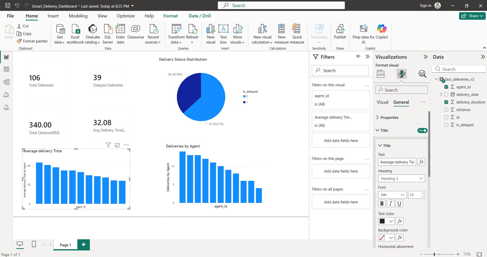
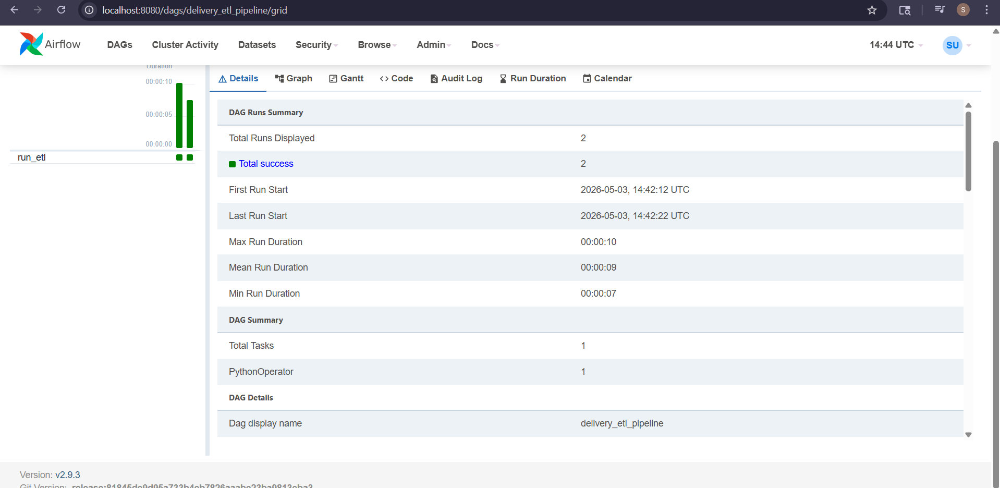
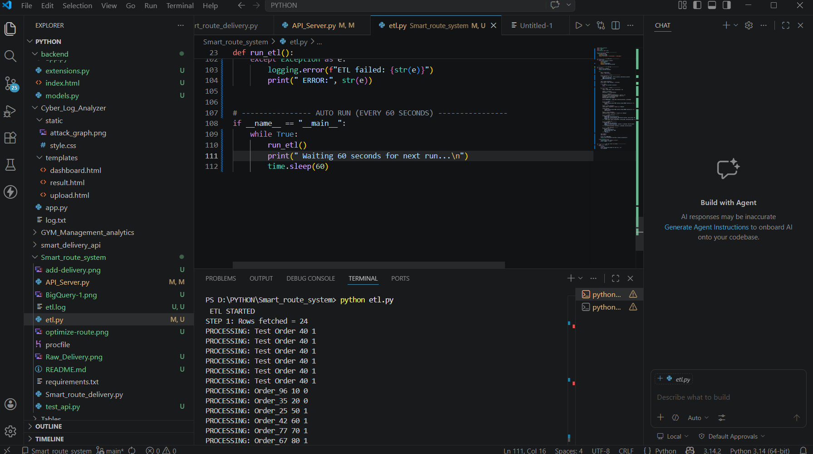
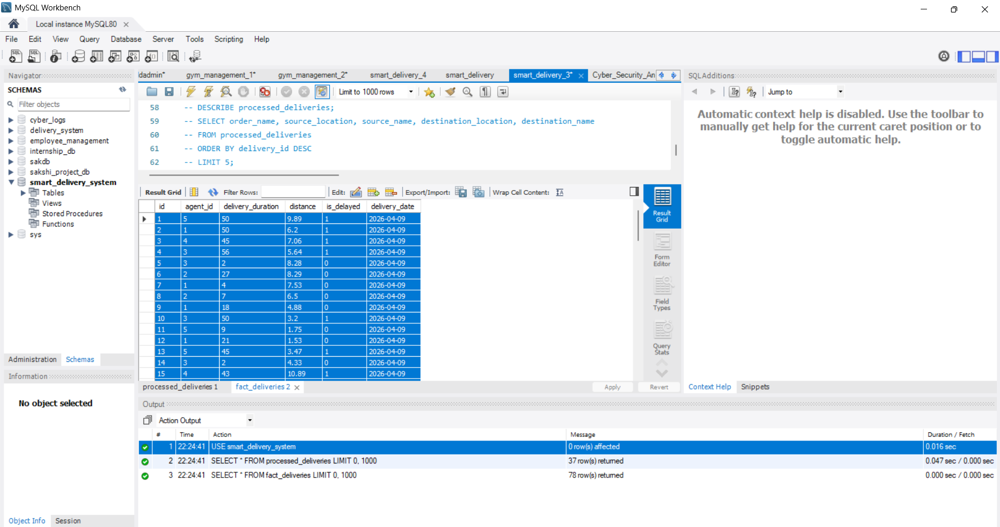

# 🚚 Smart Delivery Analytics Platform

### End-to-End Data Engineering Project using FastAPI, MySQL, BigQuery, PySpark, Apache Airflow & Power BI

---

## 🚀 Project Overview

Smart Delivery Analytics Platform is an end-to-end data engineering project that simulates a modern logistics and delivery management system.

The platform ingests delivery requests through REST APIs, stores raw operational data in MySQL, processes records using an automated ETL pipeline, loads analytical data into Google BigQuery, and visualizes business insights through interactive Power BI dashboards.

The project demonstrates real-world data engineering concepts including data ingestion, ETL processing, cloud warehousing, orchestration, analytics, and reporting.

---

# 🎯 Business Problem

Logistics companies generate thousands of delivery events every day. Without a structured analytics platform, it becomes difficult to:

* Monitor delivery performance
* Track delayed deliveries
* Evaluate agent productivity
* Analyze operational efficiency
* Support business decision-making

This project addresses these challenges by building a complete analytics pipeline from data ingestion to business reporting.

---

# 🏗️ End-to-End Architecture

```text
Client Applications
        │
        ▼
FastAPI REST APIs
        │
        ▼
MySQL Raw Layer
(raw_deliveries)
        │
        ▼
Python ETL Pipeline
        │
        ▼
Processed Layer
(processed_deliveries)
        │
        ▼
Fact Layer
(fact_deliveries)
        │
        ▼
PySpark Analytics Layer
(agent_performance)
        │
        ▼
Google BigQuery
(Cloud Data Warehouse)
        │
        ▼
Power BI Dashboard
(Business Analytics)
```

---

# ⚙️ Technology Stack

| Category | Technology |
|-----------|------------|
| Programming | Python |
| API Layer | FastAPI |
| Database | MySQL |
| ETL & Processing | Python, Pandas, PySpark |
| Cloud Warehouse | Google BigQuery |
| Orchestration | Apache Airflow |
| Containerization | Docker |
| Analytics Engineering | PySpark, Window Functions |
| Analytics | SQL |
| Visualization | Power BI |
| Version Control | Git, GitHub |

---

# 🔄 Data Pipeline Workflow

### 1. Data Ingestion

Delivery requests are received through FastAPI REST endpoints.

Example data:

```json
{
  "order_name": "Order_1001",
  "source": 3,
  "destination": 8
}
```

---

### 2. Raw Layer

Incoming records are stored in:

```sql
raw_deliveries
```

This layer preserves original operational data.

---

### 3. ETL Processing

The ETL pipeline:

* Extracts unprocessed records
* Calculates delivery metrics
* Detects delayed deliveries
* Performs data transformations
* Generates analytical datasets

---

### 4. Processed Layer

Processed records are stored in:

```sql
processed_deliveries
```

with cleaned and transformed information.

---

### 5. Fact Layer

Business-ready analytics data is stored in:

```sql
fact_deliveries
```

containing:

* Agent information
* Delivery duration
* Distance
* Delay status
* Delivery dates

---
### 6. PySpark Analytics Layer

To enhance analytical reporting, a PySpark-based analytics layer was implemented on top of the delivery fact table.

### PySpark Features Implemented

* DataFrame Transformations
* Aggregations using groupBy()
* Window Functions (RANK, ROW_NUMBER)
* Agent Performance Analytics Mart Generation

### Agent Performance KPIs

The analytics layer generates:

* Total Deliveries per Agent
* Average Delivery Time
* Total Distance Covered
* Delay Rate Percentage
* Agent Performance Ranking

### Output Dataset

PySpark generates an analytics-ready dataset:

```sql
agent_performance
```

which is published to Google BigQuery for reporting and dashboarding.
---
### 7. BigQuery Analytics Warehouse

Fact data is loaded into Google BigQuery for scalable analytics and cloud-based reporting.

Benefits:

* Fast SQL analytics
* Cloud scalability
* Analytical reporting
* Integration with BI tools

---

### 8. Power BI Dashboard

Power BI connects directly to BigQuery and provides interactive business dashboards.

---

# 📊 Power BI Dashboard

The dashboard provides operational and performance insights through:

### KPIs

* Total Deliveries
* Delayed Deliveries
* Average Delivery Time
* Total Distance Covered

### Visualizations

* Deliveries by Agent
* Average Delivery Time by Agent
* Delivery Status Distribution

### Business Insights

* Agent productivity tracking
* Delay monitoring
* Operational efficiency analysis
* Delivery performance measurement

---

# 🔌 API Endpoints

| Method | Endpoint        | Description               |
| ------ | --------------- | ------------------------- |
| POST   | /add-delivery   | Add delivery record       |
| POST   | /optimize-route | Calculate optimal route   |
| GET    | /deliveries     | Retrieve delivery records |
| POST   | /update-status  | Update delivery status    |

---

# 🧠 Route Optimization

The project includes route optimization functionality using:

### Dijkstra's Algorithm

Features:

* Shortest path computation
* Distance optimization
* Efficient delivery routing
* Reduced transportation cost

---

# 🔄 Apache Airflow Orchestration

Apache Airflow automates the ETL workflow.

Capabilities:

* Scheduled ETL execution
* Workflow monitoring
* Task orchestration
* Pipeline automation

Airflow runs using Docker containers for simplified deployment and management.

---

# 📈 Analytics Supported

The platform enables analysis of:

* Delivery volume
* Delay percentage
* Agent performance
* Average delivery duration
* Distance travelled
* Delivery trends
* Agent ranking analytics
* Performance leaderboard generation
* Operational KPIs

---

# 📸 Project Screenshots

## Power BI Dashboard



---

## Apache Airflow DAG



---

## ETL Pipeline Execution



---

## Google BigQuery Analytics Layer


---

## Fact Deliveries Table



---

# ⚡ Key Features

* FastAPI-based REST APIs
* Layered Data Architecture
* Automated ETL Processing
* Incremental Data Loading
* BigQuery Cloud Analytics
* Apache Airflow Orchestration
* Dockerized Deployment
* Route Optimization using Dijkstra's Algorithm
* PySpark Analytics Layer
* Agent Performance Analytics Mart
* Window Functions (RANK, ROW_NUMBER)
* Power BI Dashboarding
* Delivery Performance Analytics

---

# 🧩 Engineering Challenges Solved

* Built incremental ETL processing using processed flags
* Integrated MySQL with Google BigQuery
* Automated cloud analytics loading
* Implemented batch processing workflows
* Debugged schema and authentication issues
* Designed layered warehouse architecture
* Built PySpark-based analytics marts from fact tables
* Implemented Spark aggregations and window functions for agent performance ranking
* Published PySpark-generated analytics datasets to Google BigQuery
* Connected Power BI directly to BigQuery

---

# 📁 Project Structure

```text
Smart_route_system/
│
├── API_Server.py
├── etl.py
├── generate_data.py
├── requirements.txt
├── docker-compose.yml
├── Smart_Delivery_PySpark_Analytics.ipynb
│
├── Power_BI/
│   └── Smart_Delivery_Dashboard.pbix
│
├── dags/
├── screenshots/
├── etl.log
└── README.md
```

---

# 🚀 Setup Instructions

## Clone Repository

```bash
git clone https://github.com/Sakshiparve695/Smart-Delivery-Analytics-GCP.git
cd Smart-Delivery-Analytics-GCP
```

## Install Dependencies

```bash
pip install -r requirements.txt
```

## Configure Environment Variables

```env
DB_HOST=localhost
DB_USER=your_username
DB_PASSWORD=your_password
DB_NAME=smart_delivery
```

## Run FastAPI Application

```bash
python API_Server.py
```

## Run ETL Pipeline

```bash
python etl.py
```

## Start Airflow

```bash
docker-compose up
```

---

# 🚀 Future Enhancements

* Real-time streaming using Apache Kafka
* CI/CD pipeline automation
* Data quality validation framework
* Monitoring and alerting
* Real-time analytics dashboards
* Microsoft Fabric Lakehouse integration

---

# 👩‍💻 Author

**Sakshi Parve**

Aspiring Data Engineer | Python | SQL | PySpark | BigQuery | Airflow | Power BI
